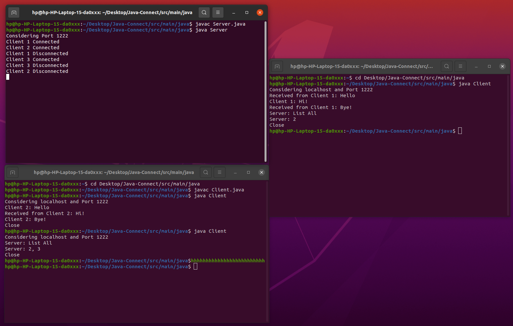

# Java-Connect

A simple Java Application to perform socket programming where a client, say client 0, should be able to send following types of messages:

1. Client X: Message - the message will be delivered to Client X.
2. All: Message - the message will be delivered to all present clients.
3. Client X,Y: Message - the message will be delivered to Client X and Y only
4. Server: "List All" - the message will go to server which will then reply with the list of all the clients that are currently connected.
5. If a client sends a message to another client which does not exist then the server should reply back saying the client does not exist.

# Detailed Explanation
The Server and the Client classes implement the Sockets for the Server and Clients. The Server connects to a client on a new thread everytime thereby making the application multithreaded. There are two interfaces present in the code which help in making the code follow the SOLID Principle. The bulk of the code has been done to the Interface than the implementation.
ClientThread class implements most of the additional functionality. First, the class decodes the type of message the sender client wants to send. It can be of 3 types:

1.	Client X,Y,Z: Msg
2.	Server: List All
3.	All: Msg

Any input other than the ones specified above is treated as invalid, special care needs to be taken about the formatting.

Following are the ways in which the server handles these:
1.	Client X,Y,Z: Msg	-	It docodes the target clients (X,Y,Z) and uses their OutputStreams to send the message received from the sender client. In case the client Y does not exists or Y is an invalid number (e.g. 0, -1, etc.), the server generates an error saying - "The client Y does not exist", and sends it to the sender client. Also, the formatting needs to be followed strictly or it will cause an error.
2.	Server: List All	-	The server maintains a map of all the active clients. It contains the clientID (key) mapped to the thread (value) on which it is running. The map is sorted in ascending order based on the keys (It is a TreeMap). Whenever a client joins, it is assigned a unique clientID and a thread. The entry is made in the map. Whenever a client exists, the thread is stopped and the entry removed. In order to list all the active clients, the server goes through all the keys listed in the map and sends them to the client in the form of a comma separated list.
3.	All: Msg	-	Here, we again make use of the hash map to find the active clients and send the message to all of them.

Consider a special case: Suppose we have 3 active clients - 1, 2, 3. Client 1 exits but later connects back. Client 2 wants to send a message to Client 1. It cannot do so as Client 1 does not exist anymore. Instead, when it rejoined, it was assigned a clientID of 4. So, Client 1 is Client 4 now. And we cannot know whether the client that left and rejoined, is an old client or a new client, i.e, we cannot know that Client 1 is Client 4. We treat every client as a new client. So, Client 2 can do nothing but send the message to Client 1 and receive an error. He can always see the list of active clients by asking it from the server.

# Directory Structure

```
├── bin
│   ├── main--
│   └── test--
├── build
│   ├── classes--
│   ├── generated--
├── build.gradle
├── gradle--
├── gradlew
├── gradlew.bat
├── images
│   └── snap.png
├── README.md
├── settings.gradle
└── src
    ├── main
    │   ├── java
    │   │   ├── ClientFunction.java
    │   │   ├── Client.java
    │   │   ├── ClientJobs.java
    │   │   ├── ClientThread.java
    │   │   ├── Server.java
    │   │   └── Socket_Interface.java
    │   └── resources
    └── test
        ├── java
        └── resources


```
# Procedure to run

The programs can be normally compiled like any other Java Program using the javac command and then executing the java executable class produced.

One can also simply use IntelliJ or Eclipse IDE to build the project and then use the inbuilt run command provided by those IDE's to run the code.

The clients can be closed be typing "Close" in the terminal.
The server runs always and can be stopped by using Ctrl+C command.

# Snapshots
